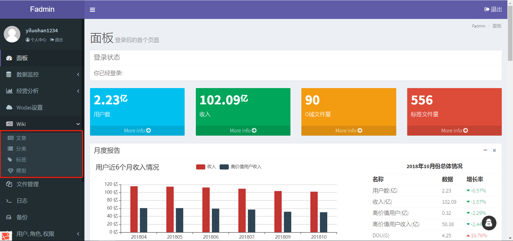

# README
## 主要功能
快速构建后台管理界面。
目前主要包括：

- 权限、用户、角色管理
- 设置管理：时间线、友情链接、基本设置、定时任务
- 数据监控
- 日志管理
- 备份管理
- 文件管理
- wiki管理（包括模型的文章说明、模型文件存储、模型的标签与分类，后续添加前台展示界面）


## 安装说明
### 1.项目地址
```
https://github.com/yiluohan1234/fadmin
```
### 2.本项目通过laradock部署larvel环境
部署说明可以参考[laradock 配置laravel环境](https://blog.csdn.net/yiluohan0307/article/details/80062899)
## 更新说明
更新说明请[参照](https://github.com/yiluohan1234/fadmin/blob/master/changlog.md)

## 部署到heroku
[](https://heroku.com/deploy)
1. 点击`Deploy`按钮
2. 构建和成功部署后，点击`Manage App`
3. 转到`settings`里边，点击`Reveal Config Vars`
4. 为数据库设置必要的配置
5. 执行以下命令进行数据库的迁移和db seed


**Database Migration**
```
$ heroku run php artisan migrate --app your_app_name
```
**Database Seeds**
```
$ heroku run php artisan migrate --app your_app_name
```
